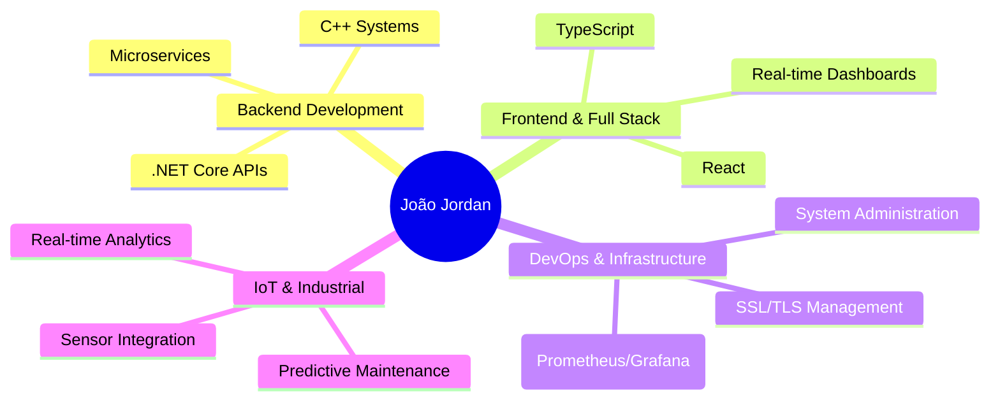

# Olá! Eu sou João Jordan

<div align="center">
  
</div>

## Sobre mim

Desenvolvedor Full Stack na **Grendene S/A** 🇧🇷, apaixonado por criar soluções robustas e escaláveis. Especialista em arquiteturas distribuídas, IoT e sistemas de alto desempenho.

```typescript
const joaoJordan = {
  location: "Brazil 🇧🇷",
  company: "Grendene S/A",
  focus: ["System Architecture", "Full Stack Development", "IoT Solutions"],
  currentlyWorking: "Innovative enterprise solutions",
  learning: "Advanced microservices patterns",
  askMeAbout: ["C++", "C#", "TypeScript", "System Design", "IoT"],
  funFact: "I love turning complex problems into elegant solutions"
};
```

## 🛠️ Tech Stack

<div align="center">

### 💻 Languages


### 🚀 Frameworks & Technologies


### 🗄️ Databases & Tools


</div>

## 🌟 Projetos em Destaque

<div align="center">

### 🔍 [AppsQt5Utilitarios](https://github.com/debjordan/AppsQt5Utilitarios )
**Contribuições OpenSource**
- Todos os Apps estão sendo desenvolvido em C++.
- Fique a vontade para contribuir e usar como quiser.

### 🏭 [Manutenção Preditiva](https://github.com/debjordan/ManutencaoPreditiva) ⭐
**Sistema completo de IoT industrial**
- Dashboard em tempo real
- Simulador de sensores IoT
- API REST para análise de dados
- Tecnologia: TypeScript&SCSS, Node.js, C# - AspNetCore


### 🛒 [E-commerce API](https://github.com/debjordan/ecommerce-api-nestjs) ⭐
**API REST completa para e-commerce**
- NestJS + TypeScript + PostgreSQL
- Autenticação JWT robusta
- Arquitetura escalável e moderna
- Projeto que criei para reforçar aprendizagem

</div>

## 📊 GitHub Stats

<div align="center">
  
  
</div>

<div align="center">
  
</div>

## 🎯 Áreas de Especialização

<div align="center">



</div>

## 📈 Contribuições Recentes

<div align="center">
  
</div>


## 📈 Profile

<div align="center">
  
[](https://www.linkedin.com/in/joãojordan/)
[](https://github.com/debjordan)

</div>

---

<div align="center">
  <i>💡 "Transformando ideias complexas em soluções elegantes, uma linha de código por vez."</i>
  
  
</div>
